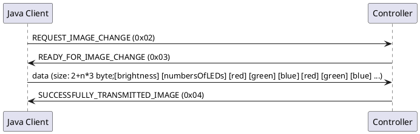
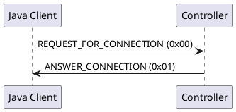
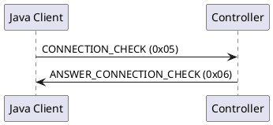
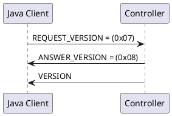
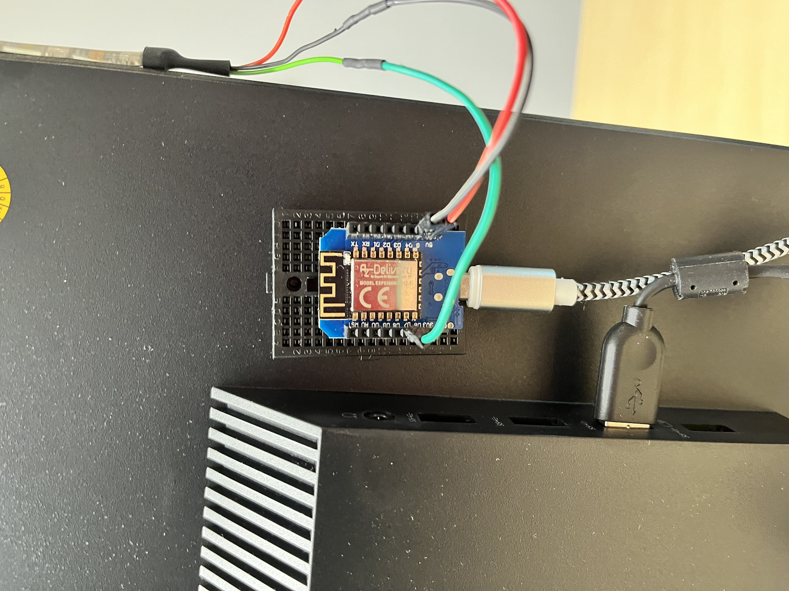

# USB LED matrix - availability status at the workstation
## Link to Busylight Client: [Busylight Client](https://github.com/doubleSlashde/Busylight-Client)
## USB API
### Update light color

### Connection

### Check for connection loss

### Check for Versioning

---

## Hardware
1. [WEMOS D1 Mini: ](https://www.wemos.cc/en/latest/d1/d1_mini.html)  
     
1. [Micro USB cable: ](https://www.cyberport.de/pc-und-zubehoer/kabel-zubehoer/kabel/good-connections/pdp/4b02-37m/good-connections-micro-usb-2-0-kabel-1m-usb-a-stecker-micro-b-stecker.html)  
     
1. [Jumper cable 3 pcs: ](https://www.berrybase.de/40pin-jumper/dupont-kabel-male-female-trennbar?number=DUPK-40-FM-20)  
   
1. [LED Strip WS2812b 10 LEDs: ](https://www.amazon.de/HJHX-LED-Streifen-individuell-adressierbar-Lichterkette/dp/B078S6Z9KG)  
   
   

### How are the LEDs connected on the WEMOS?
GND ---->  Must be on GND  
+5V ----> Must be on 5V  
DIN ----> Is freely assignable (currently in the code at D7)  

  
[WEMOS D1-mini](https://www.wemos.cc/en/latest/d1/d1_mini.html)

### How are the LEDs connected on the M5?
GND ---->  Must be on GND  
+5V ----> Must be on 5V  
DIN ----> Is freely assignable (currently in the code at G33)  

  
[M5-Stack](https://www.bastelgarage.ch/m5stack-atom-matrix-esp32-development-kit)  

The DIN connection can be set in the [platformio.ini](platformio.ini) with the property `-DPIXEL_PIN=xx` to be changed.

### You can install the Busylight e.g. on the monitor

---

## Update to MC with Visual Studio Code
1. Start Visual Studio Code and open the Busylight Microcontroller folder.  
   
1. First of all, you need to install PlatformIO IDE.  
     
1. After that you can click on the ant on the side and then you just have to press "Upload".  
   
